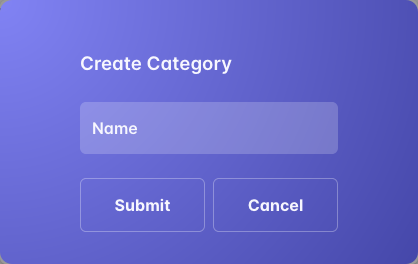

# Synergy

## Features

Web application has the following pages:
- home page
- login page
- registration page
- dashboard
- workstream
- active workstream
- task
- notification
- invites page
- join page

**Navbar**

Navbar has the following links:
- home page
- get started

The simplistic design of the navbar is based on the decision to make the use of the webapp easy for the user.

When the user is logged in, the user navbar is displayed.

- 

User Navbar has the following links:
- Dashboard
- Task
- Workstream
- Notification
- Logout

**Footer**

Footer has the following sections:

- Code copyright on left:

- links to the GitHub and LinkedIn, and facebook on right:

**Home page**

The Home page has a hero section which displays a little text about the app and an image of working on tasks

Then three application specific benefits

**Registration page**

  

This page has a white container with a sign up form, which has a header and input fields for the user to fill in.

In the header of the form, there is a title "Create Account".

Under the form's header, there is subtitle to guide the users to login if they already have an account.

Under the form's header, there are the following fields:

These fields are required for the user to be filled out.
- Username 
- Password 
- Password confirmation 

If the user leaves an empty field, they will be prompted to fill the required fields

  

If the user an username already take the username field will be highlighted.

  

If the user typed an incorrect password, the password field will be highlighted.

  

If the user typed an different password in password confirmation, the password confirmation field will be highlighted.

  

underneath the field is the submit form button to create the user profile

**Login page**

  

In the header of the form, there is a title "Welcome Back".

Under the form's header, there is subtitle to guide the users to create an account.

There are two fields which have to be filled out in order to log in:

- Username
- Password

and a remember me option

If the user made a mistake in the username or password, the field will be highlighted.

  

Under the fields, there is a button "Sign in" which leads to Dashboard page.

**Dashboard page**

  

The dashboard has a page header divider with the page title 'Dashboard'. The dashboard has three stats card, one for the user profile the second for the users active workstream and the last displaying the task report of users tasks completed and pending.

- profile edit  

  edit button to open dialog box
  

  input field for users first name and last name and image file selector for user avatar

  submit and cancel button at bottom of dialog for form submission or dialog close.

- workstream view button

  link to users active workstream page

- task view button

  link to task page

**Task page**

  

Task page has three divider, the first at the top with a button to create new tasks. The remaining two are to separate task completed for pending task.

Each task has a drop down menu to edit, unassign or delete the task.

- Create/Edit Task sidebar

  

- unassign task option

  remove the task from the users task list as no longer assigner to user

- delete task option

  task is deleted and removed from list

- task completed checkbox

  clicking the checkbox in the last list item will place the task in the appropriate list

**Workstream page**

  

Workstream page has two field sets, one for the active and the other with a list of all participating workstreams excluding the active

between the two field sets are two button to create and join workstreams

- active workstream fieldset click

  navigate user to active workstream page

- create workstream

  

- join workstream button

  navigates user to join workstream page

**Active Workstream page**

  

Consist of the page contained in a field set with legend including the workstream name and button to leave workstream or for owner to edit or delete. the content has tree levels for tabbed links

- legend button

  

  

  for participating user there is a cross to leave workstream once clicked the user will be removed from the workstream

- first level of tabbed link are for participating user and to set staff privileges if owner.

  - participating users 
    
    Display avatars of users and for workstream owner to invite more users by clicking the + button

  - Staff permission

    clicking the switch will allow or remove staff access

- second level of tabbed link are for workstream category and project which staff permission access can add and edit.
  - Category

  

  

  - Project

  

  

- lastly the tabbed links are for the workstream task.

  - open task

    clicking the download button will assign task to user
  
  - assigned task

    display all assigned task and information with task option for assigned users

**Notification page**

  

Page is split with two dividers one for users active workstream invites and the other is for logged users joi requests

- invites

  display card with link to invite page and cards with pending invite status

  - pending cards

    current user invites have option to be deleted
    

    join request for current users workstream have option to be accepted only

- join

  display card with link to join page and cards with pending join request

  - pending cards

    current user join requests have option to be deleted
    

    workstream invites from other users have option to be accepted only

**Invite page**

  

Page will display cards with information on other user profiles that have not been invited to current users active workstream or already participating in current workstream

**Join page**

  

Page will display all available workstream the current user can join that they have not already participating or awaiting accepting.