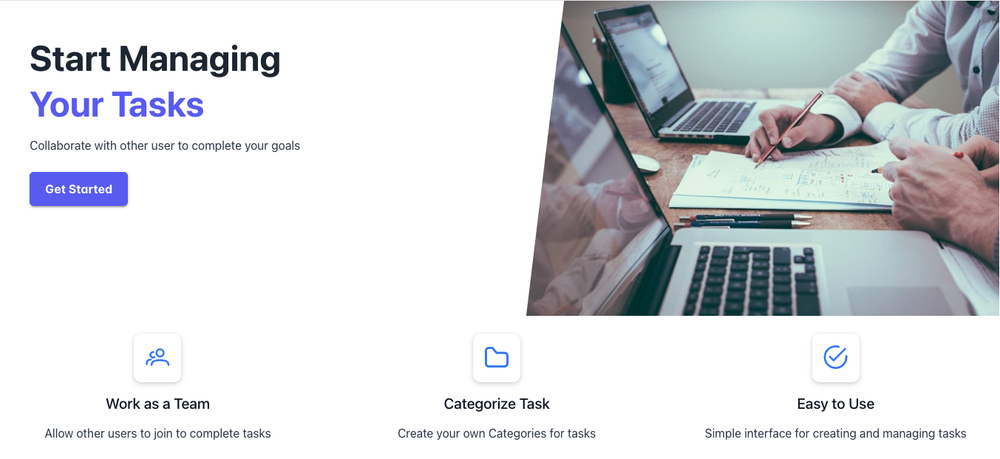

# Badminton

## Features

Web application has the following pages:
- home page
- login page
- registration page
- dashboard
- workstream
- active workstream
- task
- notification
- invites page
- join page

**Navbar**

Navbar has the following links:
- home page
- get started

The simplistic design of the navbar is based on the decision to make the use of the webapp easy for the user.

When the user is logged in, the user navbar is displayed.

- 

User Navbar has the following links:
- Dashboard
- Task
- Workstream
- Notification
- Logout

**Footer**

Footer has the following sections:

- Code copyright on left:

- links to the GitHub and LinkedIn, and facebook on right:

**Home page**

The Home page has single hero section which displays a little text about the app and an image of working on tasks

**Registration page**

  

This page has a white container with a sign up form, which has a header and input fields for the user to fill in.

In the header of the form, there is a title "Create Account".

Under the form's header, there is subtitle to guide the users to login if they already have an account.

Under the form's header, there are the following fields:

These fields are required for the user to be filled out.
- Username 
- Password 
- Password confirmation 

If the user leaves an empty field, they will be prompted to fill the required fields

If the user an username already take the username field will be highlighted.

  

If the user typed an incorrect password, the password field will be highlighted.

  

If the user typed an different password in password confirmation, the password confirmation field will be highlighted.

  

underneath the field is the submit form button to create the user profile

**Login page**

  

In the header of the form, there is a title "Welcome Back".

Under the form's header, there is subtitle to guide the users to create an account.

There are two fields which have to be filled out in order to log in:

- Username
- Password

and a remember me option

If the user made a mistake in the username or password, the field will be highlighted.

  

Under the fields, there is a button "Sign in" which leads user profile page.

**Dashboard page**

  

**Task page**

  

**Workstream page**

  

**Active Workstream page**

  

**Notification page**

  

**Invite page**

  

**Join page**

  