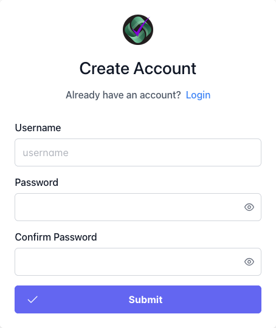
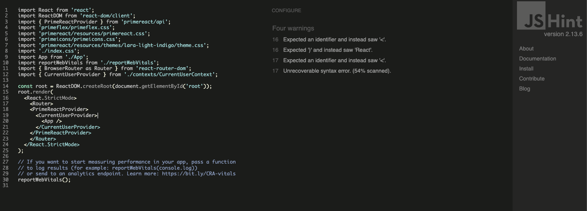

# Testing

## Manual Testing

Testing was done throughout site development, for each feature before it was merged into the master file.

Usability was tested with the below user acceptance testing, sent to new users to ensure testing from different users, on different devices and browsers to ensure issues were caught and where possible fixed during development.

|     | User Actions           | Expected Results | Y/N | Comments    |
|-------------|------------------------|------------------|------|-------------|
| Log In      |                        |                  |      |             |
| 1           | Click on Login button | Redirection to Login page | Y |          |
| 2           | Click on the SignUp link in the form | Redirection to SignUp page | Y |          |
| 3           | Enter valid email or username | Field will only accept email address format | Y |          |
| 4           | Enter valid password | Field will only accept secure passwords | Y |          |
| 5           | Click on the Login button | Takes user to profile page with pop-up confirming successful sign in. User navigation displayed | Y |          |
| 6           | Click "Logout" button | Redirects user to home page with pop-up confirming successful sign out| Y |          |
| Sign Up     |                        |                  |      |             |
| 1           | Click on the Sign Up button | Redirects to Sign up page | Y |          |
| 2           | Click on the Login link in the form | Redirection to Login page | Y |          |
| 3           | Enter valid email | Field will only accept email address format | Y |          |
| 4           | Enter valid username | Field will only accept non existing usernames | Y |          |
| 5           | Enter valid password | Field will only accept secure passwords | Y |          |
| 6           | Enter valid password confirmation | Field will only accept the same password from the previous field | Y |          |
| 7           | Click on the Submit button | creates user and takes user to profile page with pop-up confirming successful sign in | Y |          |
| 8           | Click "Logout" button | Redirects user to home page with pop-up confirming successful sign out| Y |          |

---

## Testing User Story

| First Time Visitor Goals | Requirement met | Image |
| ------------------------- | --------------- | ----- |
| As a ""user"" I can ""create an account"" so that ""i can use the application"". | Y |  |
| As a ""User"" I can ""login"" so that ""I can view my profile"". | Y |  |
| As a ""User"" I can ""Add my friends"" so that ""we can organize events to play"". | Y |  |

| Frequent Visitor Goals    | Requirement met | Image |
| ------------------------- | --------------- | ----- |
| As a ""User"" I can ""invite friends to group"" so that ""we can play together"". | Y |  |
| As a ""User"" I can ""create a game session"" so that ""available players can play"". | Y |  |
| As a ""User"" I can ""accept session invitation"" so that ""i can join the session"". | Y |  |
| As a ""User"" I can ""view my previous session"" so that ""i can compare my progress"". | Y |  |
| As a ""User"" I can ""View group leaderboards"" so that ""i can improve my rank"". | Y |  |
| As a ""Session Admin"" I can ""appoint game admin"" so that ""they can enter team results"". | Y |  |
| As a ""Session Admin"" I can ""generate all game fixtures"" so that ""we know which games to play"". | Y |  |
| As a ""Game Admin"" I can ""Enter game score results"" so that ""we know who won"". | Y |  |
| As a ""Session Admin"" I can ""assign teams manually"" so that ""the match can start"". | Y | new game select field displays all available teams |
| As a ""Session Admin"" I can ""invite more players from group"" so that ""we can play more match ups"". | Y |  |
| As a ""Group User"" I can ""join open sessions"" so that ""I can play"". | Y |  |
| As a ""User"" I can ""Change my user details"" so that ""i reflect most recent changes"". | Y |  |
| As a ""Group Host"" I can ""Change group name and details"" so that ""it reflects the current changes"". | Y |  |
| As a ""User participating in a session"" I can ""see all groups"" so that ""i can join future session"". | Y |  |
| As a ""Session Admin"" I can ""update session details"" so that ""player know of date changes"". | Y |  |

---

## Bugs

### Known bugs

Due to the user updated to the react router dom the history.push no longer works

### Solved bugs

There were plenty of bugs during the development process since this project was a learning platform for me and allowed me to improve my skills and knowledge significantly.

One of the bugs was due to the deadline taking local date format causing an error for american date format. This was solved using the moments.js date formatter to pass correct value when form was submitted

Due to this being my first application utilizing my own api the endpoint required the trailing slash which was omitted.

There was a bug that new users can access their active workstream page before they created a workstream which only displayed the loading spinner. I solved this by adding a conditional if statement in the active workstream component to return the user to the workstream page.

---

## Validation:
### HTML Validation:

- [HTML Validation Report](documentation/validation/html_validation.png)

- No errors or warnings were found when passing through the official [W3C](https://validator.w3.org/) validator. This checking was done manually by copying the view page source code (Ctrl+U) and pasting it into the validator.

- Since the application's frontend is written in React the page source only displays reacts initial index.html

### CSS Validation:

- All application CSS using Primereact and Primeflex library, no other external CSS used

### JS Validation:

- Since the application's frontend is written in React, I could not use the JSHint validator to validate the application. As you can down below, JSHint just doesn't understand JSX syntax.

- But React itself validates the code on each build, and if there were any errors, the application would not be able to run.
- Since it runs correctly, we can consider all the code to be valid.

### Python Validation:

- [Full Python Validation Report](documentation/validation/python_validation.pdf)

- No errors were found when the code was passed through [CI Python Linter](https://pep8ci.herokuapp.com/#). According to the reports, the code is [Pep 8-compliant](https://legacy.python.org/dev/peps/pep-0008/). This checking was done manually by copying python code and pasting it into the validator.

---
## Lighthouse Report

- [Full Lighthouse Report](documentation/validation/lighthouse_report.pdf)

---

## Compatibility

Testing was conducted on the following browsers;

- Safari;
- Chrome;
- Firefox;

- [Compatibility Report](documentation/validation/compatibility_report.pdf)

---

# Responsiveness

The responsiveness was checked manually by using devtools (Chrome) throughout the whole development. It was also checked with [Responsive Viewer](https://chrome.google.com/webstore/detail/responsive-viewer/inmopeiepgfljkpkidclfgbgbmfcennb/related?hl=en) Chrome extension.

Primeflex library used to handle responsive mobile first approach.

- [Responsive Report](documentation/validation/responsive_report.pdf)
---